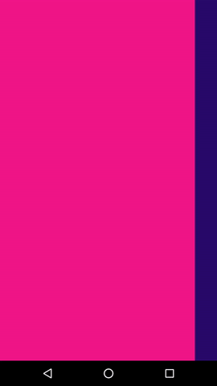
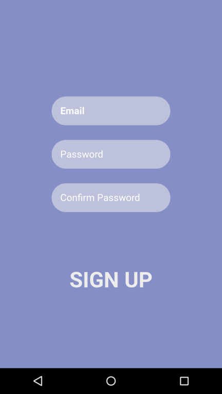
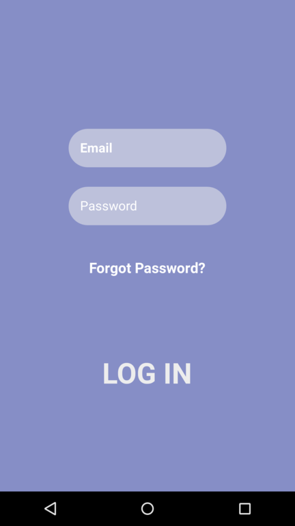

Most applications today have an authorization activity which can be done with Facebook, Google, Twitter or you can do it in the old fashioned way — with an email and password. It may not be the very first screen of your application (many apps have welcome screens, like a sneak peek of the app).

The objective here is that you don’t want to make the authorization process more painful than it usually is, right? You want to leave the user with a good impression of your application, even more — it is your responsibility to provide them with a feeling of delight and excitement.


## Where to start?

I’d had a struggle with designing a login/sign up screen for one of my Android apps before I stumbled upon this excellent design concept. Designed by **Yaroslav Zubko**:


> Imitation is the sincerest form of flattery, right?

So, I decided to implement the idea and will provide a comprehensive guide to creating the above from scratch throughout the article. If you are this kind of person who likes to read the code, you may want to skip to the end of the article.


## Structure of the app.

Apart from making this splendid interaction, I want to make the code reusable, and to separate the main concerns. That is, my login screen should know nothing about the sign up screen and vice versa.

Now, let’s take a look at the concept again and define the nuts and bolts.


- Background image.
- Sign up screen.
- Login screen.
- Gap at the edges of each screen.
- Input fields.
- Logo, bottom buttons and login /sign up labels.

I think it is not a significant effort to interpret these components in terms of Android Views.
For instance, each screen should be an Android `Fragment`, and you can use a `ViewPager` to switch
between them. The background, logo, and buttons could be simple `ImageView` objects.


I think it is not a significant effort to interpret these components in terms of Android Views. For instance, each screen should be an Android Fragment, and you can use a ViewPager to switch between them. The background, logo, and buttons could be simple ImageView objects.

So, the application will have the following structure:

- Activity with a `ViewPager`
- Adapter
- Login `Fragment`
- Sign Up `Fragment`

## What about the gap?
That’s one of the reasons why I have chosen to use the `ViewPager` component; its adapter has the `getPageWidth` method which returns the proportional width of a given page as a percentage of the `ViewPager`’s measured width from (0.f-1.f]. You can adjust the width of a particular page to fit your needs, and the next/previous pages will be shifted to the left/right to fill the gap which has been left by the current page.

Here’s how it looks like:

<p align="center">
  
</p>

>How do we know the width of the gap? And what about the text that should be positioned vertically in the middle of the gap?

Don’t worry about it; we’ll create a factor variable which is calculated in the constructor of our adapter, and then will use that factor in the `getPageWidth` method as shown below in the code.

```java
public static class Adapter extends FragmentStatePagerAdapter{
  //our factor value
  private float factor;

  public Adapter(FragmentManager manager, final ViewPager pager){
    super(manager);
    final float textSize = pager.getResources().getDimension(R.dimen.folded_size);
    final float textPadding = pager.getResources().getDimension(R.dimen.folded_label_padding);
    factor = 1 - (textSize + textPadding) / (pager.getWidth());
  }

  @Override
  public float getPageWidth(int position) {
    return factor;
  }
}
```

Let’s break it down:

1. textSize is the size of the text when it’s been folded (vertical text).
2. textPadding is simple padding from the left and right sides.
3. We add the size and padding, divide that by the width of the screen, and then subtract the whole thing from one. Now, if we multiply what we’ve got by the page’s width, we should be able to clip the current page. Refer to the result above.

## Authorization Activity

It’s time to get to the meat of the matter! The meat is our Android `Activity`.

First things first — the XML file:

```xml
<android.support.constraint.ConstraintLayout
    xmlns:android="http://schemas.android.com/apk/res/android"
    xmlns:app="http://schemas.android.com/apk/res-auto"
    xmlns:tools="http://schemas.android.com/tools"
    android:id="@+id/root"
    android:layout_width="match_parent"
    android:layout_height="match_parent"
    tools:context="com.vpaliy.loginconcept.LoginActivity">

    <ImageView
        android:id="@+id/scrolling_background"
        android:layout_width="0dp"
        android:layout_height="0dp"
        android:scaleType="centerCrop"
        tools:src="@drawable/busy"
        android:scaleX="@dimen/start_scale"
        android:scaleY="@dimen/start_scale"
        app:layout_constraintBottom_toBottomOf="parent"
        app:layout_constraintLeft_toLeftOf="parent"
        app:layout_constraintRight_toRightOf="parent"
        app:layout_constraintTop_toTopOf="parent"
        app:layout_constraintVertical_bias="0.0" />

    <com.vpaliy.loginconcept.AnimatedViewPager
        android:id="@+id/pager"
        android:layout_width="0dp"
        android:layout_height="0dp"
        android:background="@color/color_log_in"
        app:layout_constraintBottom_toBottomOf="parent"
        app:layout_constraintHorizontal_bias="1.0"
        app:layout_constraintLeft_toLeftOf="parent"
        app:layout_constraintRight_toRightOf="parent"
        app:layout_constraintTop_toTopOf="parent"
        app:layout_constraintVertical_bias="0.0" />

    <ImageView
        android:src="@drawable/facebook"
        android:layout_width="@dimen/option_size"
        android:layout_height="@dimen/option_size"
        android:id="@+id/first"
        app:layout_constraintRight_toLeftOf="@+id/second"
        app:layout_constraintLeft_toLeftOf="parent"
        app:layout_constraintBottom_toBottomOf="parent"
        app:layout_constraintTop_toTopOf="parent"
        app:layout_constraintVertical_bias="0.95" />

    <ImageView
        android:src="@drawable/linkedin"
        android:layout_width="@dimen/option_size"
        android:layout_height="@dimen/option_size"
        android:id="@+id/second"
        app:layout_constraintLeft_toRightOf="@+id/first"
        app:layout_constraintRight_toLeftOf="@+id/last"
        app:layout_constraintTop_toTopOf="@+id/first"
        app:layout_constraintBottom_toBottomOf="@+id/first"
        app:layout_constraintVertical_bias="0.0" />

    <ImageView
        android:src="@drawable/twitter"
        android:id="@+id/last"
        android:layout_width="@dimen/option_size"
        android:layout_height="@dimen/option_size"
        app:layout_constraintRight_toRightOf="parent"
        app:layout_constraintLeft_toRightOf="@+id/second"
        app:layout_constraintBottom_toBottomOf="@+id/second"
        app:layout_constraintTop_toTopOf="@+id/second"
        app:layout_constraintVertical_bias="1.0" />

    <android.support.constraint.Guideline
        android:layout_width="wrap_content"
        android:layout_height="wrap_content"
        android:id="@+id/guideline"
        app:layout_constraintGuide_begin="@dimen/guideline_margin"
        android:orientation="horizontal" />

    <ImageView
        android:id="@+id/logo"
        android:focusable="true"
        android:src="@drawable/log"
        android:focusableInTouchMode="true"
        app:layout_constraintTop_toTopOf="@+id/guideline"
        app:layout_constraintLeft_toLeftOf="parent"
        app:layout_constraintRight_toRightOf="parent"
        android:layout_width="@dimen/logo_size"
        android:layout_height="@dimen/logo_size"/>
</android.support.constraint.ConstraintLayout>
```

I’m using a `ConstraintLayout`, as a parent view, which allows you to build complex and responsive layouts in a flat hierarchy of views. The well-known advice in Android is to avoid creating deep hierarchies of Views in your layouts because it hurts the performance and increases the time of drawing your UI on the screen.

I assume that you are familiar with `ConstraintLayout` and how it works. If you are not, I highly recommend reading [this](https://developer.android.com/training/constraint-layout/).


Another interesting view in the XML file above is `AnimatedViewPager`. It is a custom view which does not respond to any touch events and changes the duration of a swipe. For the sake of conciseness, I won't paste the code here but provide a link. You can find it [here](https://gist.github.com/vpaliy/f05ca9dd39fedbd4ee4a3bdabca2f084).

Last but not least, let's talk about the logo and buttons. These elements will be shared across **Sign In** and **Sign Up** screens; therefore it is reasonable to keep them in one place. The logo, as well as the buttons, are simple `ImageView` objects which are smoothly translated from one fragment to another.


## Second things second — the activity class.
Let's take a look at the full picture first and them move on to the details. Ready?

```java
public class AuthActivity extends AppCompatActivity {

  @BindViews(value = {R.id.logo, R.id.first, R.id.second, R.id.last})
  protected List<ImageView> sharedElements;

  @Override
  protected void onCreate(Bundle savedInstanceState) {
    super.onCreate(savedInstanceState);
    setContentView(R.layout.activity_login);
    ButterKnife.bind(this);
    final AnimatedViewPager pager = ButterKnife.findById(this, R.id.pager);
    final ImageView background = ButterKnife.findById(this, R.id.scrolling_background);
    final int[] screenSize = screenSize();

    sharedElements.forEach(element -> {
      @ColorRes int color = element.getId() != R.id.logo ? R.color.white_transparent : R.color.color_logo_log_in;
      DrawableCompat.setTint(element.getDrawable(), ContextCompat.getColor(this, color));
    });
    //load a very big image and resize it, so it fits our needs
    Glide.with(this)
            .load(R.drawable.busy)
            .asBitmap()
            .override(screenSize[0] * 2, screenSize[1])
            .diskCacheStrategy(DiskCacheStrategy.RESULT)
            .into(new ImageViewTarget<Bitmap>(background) {
              @Override
              protected void setResource(Bitmap resource) {
                background.setImageBitmap(resource);
                background.scrollTo(-pager.getWidth(), 0);
                background.post(() -> {
                  //we need to scroll to the very left edge of the image
                  //fire the scale animation
                  ObjectAnimator xAnimator = ObjectAnimator.ofFloat(background, View.SCALE_X, 4f, background.getScaleX());
                  ObjectAnimator yAnimator = ObjectAnimator.ofFloat(background, View.SCALE_Y, 4f, background.getScaleY());
                  AnimatorSet set = new AnimatorSet();
                  set.playTogether(xAnimator, yAnimator);
                  set.setDuration(getResources().getInteger(R.integer.duration));
                  set.start();
                });
                final AuthAdapter adapter = new AuthAdapter(getSupportFragmentManager(), pager, background, sharedElements);
                pager.setAdapter(adapter);
              }
            });
  }

  private int[] screenSize() {
    final Display display = getWindowManager().getDefaultDisplay();
    final Point size = new Point();
    display.getSize(size);
    return new int[]{size.x, size.y};
  }
}
```

#### Tinting the shared elements
As you may have noticed, the shared components in the original design are not so opaque. The bottom elements should be close to transparency, let’s say `#B3FFFCFC` (just a white color with opacity 173). The logo changes as it goes to another page, whereas the bottom elements do not. You can see that it always has a lighter color than the current background.

That’s where the tinting occurs:
```java
sharedElements.forEach(element -> {
  @ColorRes int color = element.getId() != R.id.logo ? R.color.white_transparent : R.color.color_logo_log_in;
  DrawableCompat.setTint(element.getDrawable(), ContextCompat.getColor(this, color));
});
```

#### Background image.
You need to stretch out the background image by its width, so it is as wide as your two pages together. It’s good to pick up a big image(approximately 1,900 x 1,200 JPEG, 24-bit color), so it could be drawn without losing any quality.

It is pretty simple — fetch the width of the screen, multiply by 2, and load the image using `Glide`, `Picasso`, `Fresco` or whatever image loading library you like.

```java
//load a very big image and resize it, so it fits our needs
Glide.with(this)
 .load(R.drawable.busy)
 .asBitmap()
 .override(screenSize[0]*2,screenSize[1])
 .diskCacheStrategy(DiskCacheStrategy.RESULT)
 .into(new ImageViewTarget<Bitmap>(background) {
   @Override
   protected void setResource(Bitmap resource) {
      background.setImageBitmap(resource);
      background.post(()->{
        //we need to scroll to the very left edge of the image
        background.scrollTo(-background.getWidth()/2,0);
        //fire the scale animation
        final ObjectAnimator xAnimator=ObjectAnimator.ofFloat(background,View.SCALE_X,4f,background.getScaleX());
        final ObjectAnimator yAnimator=ObjectAnimator.ofFloat(background,View.SCALE_Y,4f,background.getScaleY());
        final AnimatorSet set=new AnimatorSet();
        set.playTogether(xAnimator,yAnimator);
        set.setDuration(getResources().getInteger(R.integer.duration));
        set.start();
      });
      final AuthAdapter adapter = new AuthAdapter(getSupportFragmentManager(), pager, background, sharedElements);
      pager.setAdapter(adapter);
    }
});
```
Breaking down this code snippet into three simple steps:

1. After you have loaded the image, you need to shift the user focus to the very left edge of your image by using the `ImageView.scrollTo` method.
2. Afterward, you want to fire a scale animation; this way you will get this beautiful scale effect.
A GIF would have some jerks; a video is a more smooth option.

3. Last but certainly not least, initialize your adapter.


## Adapter and its guts.
We need to have a controller that is aware of what’s going on between those fragments. The perfect candidate for this role is our adapter.

We will have a base class for the fragments, which serves as an interface that can be referred to by the adapter.

This is our abstract class:
```java
public abstract class AuthFragment extends Fragment {

  protected Callback callback;

  @Nullable
  @Override
  public View onCreateView(LayoutInflater inflater, @Nullable ViewGroup container, @Nullable Bundle savedInstanceState) {
    View root = inflater.inflate(authLayout(), container, false);
    ButterKnife.bind(this, root);
    return root;
  }

  public void setCallback(@NonNull Callback callback) {
    this.callback = callback;
  }

  @OnClick(R.id.caption)
  public void unfold() {
        /* animation goes here
           ...   ....
        */
    //after everything's been set up, tell the ViewPager to flip the page
    callback.show(this);
  }

  @LayoutRes
  public abstract int authLayout();

  public abstract void fold();

  public abstract void clearFocus();

  interface Callback {
    void show(AuthFragment fragment);

    void scale(boolean hasFocus);
  }
}
```

As you can see we have three methods for each type of animation. This way you can refer to both fragments without knowing who is who.

To avoid any confusion, let’s go through the methods above:

- **fold** is called when you are switching to the next/previous page for the current fragment.
- **unfold** is called for the next/previous page before a switch. Please, keep in mind that the method isn’t called by the adapter. This method gets called when a click event occurs — when you click on that vertical `TextView`.
- **clearFocus** is called when you release the inputs. For example, when you have entered your password or email, we need to clear the focus. At this moment a scale animation is fired as well.
- **authLayout** provides a resource to inflate in the `Fragment.onCreateView` method.

> What about that callback interface?

We need to provide the ability to notify the adapter about any events that occur in the fragments. The solution is simple — let the adapter to implement the `AuthFragment.Callback`.

Here is the code of our adapter:
```java
public class AuthAdapter extends FragmentStatePagerAdapter
        implements AuthFragment.Callback {

  private final AnimatedViewPager pager;
  private final SparseArray<AuthFragment> authArray;
  private final List<ImageView> sharedElements;
  private final ImageView authBackground;
  private float factor;

  public AuthAdapter(FragmentManager manager, AnimatedViewPager pager,
                     ImageView authBackground, List<ImageView> sharedElements) {
    super(manager);
    this.authBackground = authBackground;
    this.pager = pager;
    this.authArray = new SparseArray<>(getCount());
    this.sharedElements = sharedElements;
    pager.setDuration(pager.getResources().getInteger(R.integer.duration));
    final float textSize = pager.getResources().getDimension(R.dimen.folded_size);
    final float textPadding = pager.getResources().getDimension(R.dimen.folded_label_padding);
    factor = 1 - (textSize + textPadding) / (pager.getWidth());
  }

  @Override
  public AuthFragment getItem(int position) {
    AuthFragment fragment = authArray.get(position);
    if (fragment == null) {
      fragment = position != 1 ? new LogInFragment() : new SignUpFragment();
      authArray.put(position, fragment);
      fragment.setCallback(this);
    }
    return fragment;
  }

  @Override
  public void show(AuthFragment fragment) {
    final int index = authArray.keyAt(authArray.indexOfValue(fragment));
    pager.setCurrentItem(index, true);
    shiftSharedElements(getPageOffsetX(fragment), index == 1);
    for (int jIndex = 0; jIndex < authArray.size(); jIndex++) {
      if (jIndex != index) {
        authArray.get(jIndex).fold();
      }
    }
  }

  private float getPageOffsetX(AuthFragment fragment) {
    int pageWidth = fragment.getView().getWidth();
    return pageWidth - pageWidth * factor;
  }

  private void shiftSharedElements(float pageOffsetX, boolean forward) {
    final Context context = pager.getContext();
    //since we're clipping the page, we have to adjust the shared elements
    AnimatorSet shiftAnimator = new AnimatorSet();
    for (View view : sharedElements) {
      float translationX = forward ? pageOffsetX : -pageOffsetX;
      float temp = view.getWidth() / 3f;
      translationX -= forward ? temp : -temp;
      ObjectAnimator shift = ObjectAnimator.ofFloat(view, View.TRANSLATION_X, 0, translationX);
      shiftAnimator.playTogether(shift);
    }

    int color = ContextCompat.getColor(context, forward ? R.color.color_logo_sign_up : R.color.color_logo_log_in);
    DrawableCompat.setTint(sharedElements.get(0).getDrawable(), color);
    //scroll the background by x
    int offset = authBackground.getWidth() / 2;
    ObjectAnimator scrollAnimator = ObjectAnimator.ofInt(authBackground, "scrollX", forward ? offset : -offset);
    shiftAnimator.playTogether(scrollAnimator);
    shiftAnimator.setInterpolator(new AccelerateDecelerateInterpolator());
    shiftAnimator.setDuration(pager.getResources().getInteger(R.integer.duration) / 2);
    shiftAnimator.start();
  }

  @Override
  public void scale(boolean hasFocus) {
    final float scale = hasFocus ? 1 : 1.4f;
    final float logoScale = hasFocus ? 0.75f : 1f;
    final View logo = sharedElements.get(0);

    final AnimatorSet scaleAnimation = new AnimatorSet();
    scaleAnimation.playTogether(ObjectAnimator.ofFloat(logo, View.SCALE_X, logoScale));
    scaleAnimation.playTogether(ObjectAnimator.ofFloat(logo, View.SCALE_Y, logoScale));
    scaleAnimation.playTogether(ObjectAnimator.ofFloat(authBackground, View.SCALE_X, scale));
    scaleAnimation.playTogether(ObjectAnimator.ofFloat(authBackground, View.SCALE_Y, scale));
    scaleAnimation.setDuration(200);
    scaleAnimation.setInterpolator(new AccelerateDecelerateInterpolator());
    scaleAnimation.start();
  }

  @Override
  public float getPageWidth(int position) {
    return factor;
  }

  @Override
  public int getCount() {
    return 2;
  }
}
```

This is the most significant part here. Let's go over this.

First of all, you’ve seen that **constructor** early in the article. We simply calculate a factor for the gap and then set the duration of swipes for the `ViewPager`. Also, we create an array of fragments; it’s easier to fetch a fragment by its position.

- **show** method is responsible for folding the current fragment, shifting the shared elements, and switching to another fragment using the `ViewPager.setCurrentItem` method. As I said before, this method gets called from one of the fragments.
- **getPageOffsetX** is just a helper method which returns the width of the gap for each fragment.
- **shiftSharedElements** since we’re clipping the fragments (in order to get the gap), we need to adjust the shared elements, so they don’t look crooked relatively to the fragment layout. Just create a simple translation animation which runs along with other animations.
scale scales up/down the background image when a text input has lost/gained focus.
That is all.
- **scale** scales up/down the background image when a text input has lost/gained focus.

## Sign In and Sign Up screens.
Alright, it’s time to hit the main screens. It is obvious that we will have similar XML files for each fragment. In fact, we will have only one more set of views in the `Sign Up` fragment, and a simple `TextView` for the `Sign In` fragment. Therefore it makes sense to have the same ids for each “duplicated” view.

Having said that, let’s take a look at the XML file of the `Sign-Up` screen:

<p align="center">
  
</p>

**Note**: the inputs gain focus as soon as your app enters that screen; this results in bringing up the keyboard, and we don’t want this. That is why I have a simple `View` at the top of the layout that captures focus before the inputs do.

I’m using a simple `TextInputEditText` view for every single input field, which is wrapped into a `TextInputLayout` (that’s how we get the floating label at the top).

To prevent duplication of attributes for every `TextInputEditText` view in the file, I created a style which contains all the common attributes. I did the same thing for the `TextInputLayout` views as well. You will find this here.

By the way, have you noticed something here? The password text is thinner than the email text. Also, there are some minor issues with the floating label. In order to fix this, you have to write some code in the `onCreate` method:
```java
views.forEach(editText -> {
  if (editText.getId() == R.id.password_input_edit) {
    final TextInputLayout inputLayout = ButterKnife.findById(view, R.id.password_input);
    final TextInputLayout confirmLayout = ButterKnife.findById(view, R.id.confirm_password);
    Typeface boldTypeface = Typeface.defaultFromStyle(Typeface.BOLD);
    inputLayout.setTypeface(boldTypeface);
    confirmLayout.setTypeface(boldTypeface);
    editText.addTextChangedListener(new TextWatcherAdapter() {
      @Override
      public void afterTextChanged(Editable editable) {
        inputLayout.setPasswordVisibilityToggleEnabled(editable.length() > 0);
      }
    });
   }
   editText.setOnFocusChangeListener((temp, hasFocus) -> {
     if (!hasFocus) {
       boolean isEnabled = editText.getText().length() > 0;
       editText.setSelected(isEnabled);
     }
   });
});
```

**Note**: this code uses the `forEach` method which doesn’t work with the API lower than 24. You may have to use simple iterations.

Also, you can have a rectangular background of the inputs if you want. Change the `android:radius` attribute to `0dp`:

```xml
<shape xmlns:android="http://schemas.android.com/apk/res/android">
    <corners android:radius="50dp"/>  <!-- Change this line here to 0dp -->
    <stroke android:color="#87eeeeee"/>
    <solid android:color="#87eeeeee"/>
</shape>
```

For the sake of completeness, here’s a snapshot of the `Sign In` fragment:
<p align="center">
  
</p>

As you can see, I’m using a custom view called `VerticalTextView`. That’s the bold text that says (Log In). You can check out the code [here](https://github.com/vpaliy/android-login/blob/master/app/src/main/java/com/vpaliy/loginconcept/VerticalTextView.java).

> Why do we need a custom `TextView` if we can just utilize the `View.setRotation` method instead?

I wish I could do this. The problem here is that it doesn’t really rotate the view. It rotates only the text inside, but it doesn’t change the width or height of the object at all. This really messes up the layout.

If you look a bit closer, you will see that the bounds of the view are still horizontal even though the text is vertical. (I’d enabled the Show layout bounds option before making the shot)

<p align="center">
  
</p>

The point is that the `VerticalTextView` gets the job done. It has some problems with the animation though (later in the article). Refer to this link for more detail.
